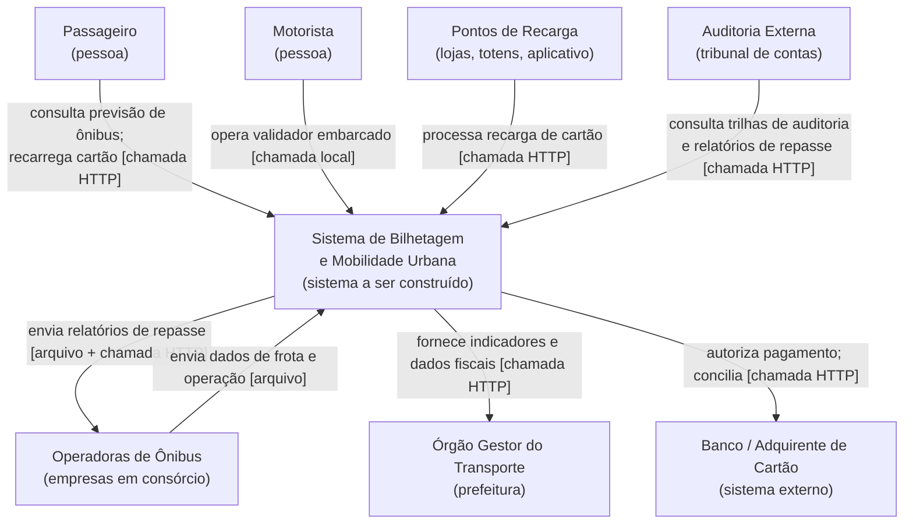
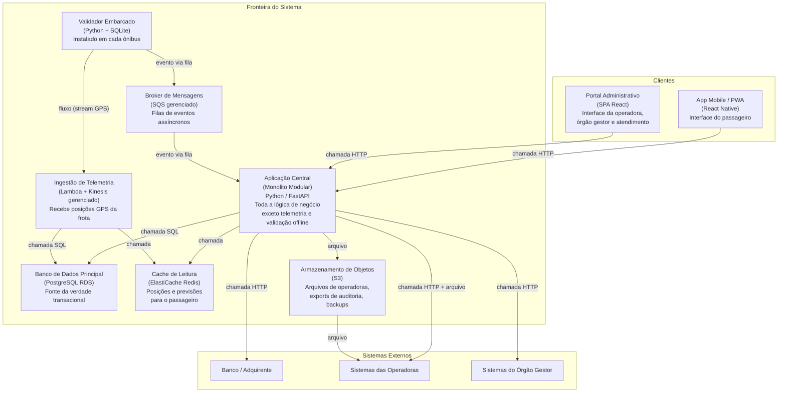
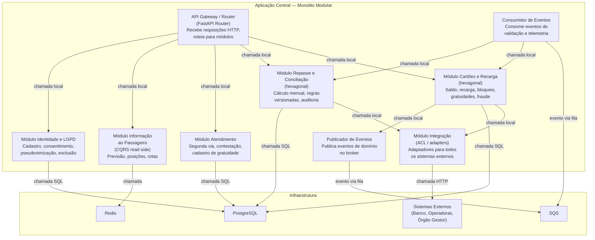

# Documento de Arquitetura

**Caso:** Ônibus — bilhetagem e mobilidade urbana  
**Envelope:** A — startup com 6 desenvolvedores, sem equipe de operação, caixa para 6 meses, nuvem pública paga por uso  
**Grupo:** 08  
**Disciplina:** Padrões e Arquitetura de Software — PUC-Campinas — 2026-2

---

## 1. Resumo executivo

A arquitetura proposta é um **monolito modular** como unidade central, combinado com **fluxos assíncronos orientados a eventos** nos pontos do domínio que são naturalmente desacoplados no tempo (validação embarcada offline, telemetria e projeções de leitura). Dentro dos módulos com integrações externas e regras densas, aplicamos o padrão **hexagonal (ports & adapters)** para isolar o domínio da infraestrutura. Para a informação ao passageiro, adotamos **CQRS** com modelo de leitura separado, e para tarefas episódicas de ingestão de telemetria e processamento de arquivos, usamos **funções serverless**.

### Por que essa composição

O Envelope A impõe três restrições simultâneas: equipe mínima (6 pessoas), ausência de operação dedicada e caixa curta (6 meses). Isso elimina arquiteturas que exigem governança distribuída, observabilidade complexa ou duplicação de infraestrutura — como microsserviços plenos, SOA com ESB ou arquitetura celular. Ao mesmo tempo, o domínio de transporte é heterogêneo: validação embarcada funciona sem rede, telemetria é fluxo contínuo de alta vazão e o repasse financeiro é lote mensal auditável. Um monolito puramente em camadas não daria conta dessa heterogeneidade sem virar uma bola de lama.

O monolito modular resolve: uma única unidade de implantação (custo operacional baixo) com fronteiras de domínio internas verificáveis (modificabilidade alta). Os fluxos assíncronos resolvem o desacoplamento temporal que o caso exige. A combinação entrega rápido sem enterrar a equipe.

### O que NÃO estamos fazendo agora — e como não vai doer depois

| O que adiamos | Por quê | Como protegemos a evolução |
|---|---|---|
| Microsserviços | 6 devs não sustentam deploy, rede e observabilidade distribuída | Módulos com contratos explícitos; extrair para serviço exige apenas criar um adaptador HTTP onde hoje há chamada local |
| Arquitetura celular | Custo e maturidade operacional desproporcionais para o piloto | Identificadores estáveis de operadora/veículo; sem estado global desnecessário |
| Event sourcing global | Conflito com LGPD (exclusão de dados pessoais), complexidade de projeção e reprocessamento para equipe pequena | Eventos assíncronos nos fluxos certos; regras tarifárias versionadas; registros financeiros imutáveis separados de dados pessoais |
| Multi-região | Sem demanda; custo alto | Sem dependência de região específica na aplicação; serviços gerenciados permitem replicar depois |
| Plataforma DevOps própria | Sem equipe de operação | Serviços gerenciados (banco, fila, observabilidade) substituem operação manual |

---

## 2. Diagrama C4 — Nível 1: Contexto do Sistema

### Descrição do contexto

O **Sistema de Bilhetagem e Mobilidade Urbana** é a fronteira do software que o grupo projeta. Ele interage com sete categorias de atores externos:

- **Passageiro**: usa o cartão no ônibus e o aplicativo para consultar horários e recarregar.
- **Motorista**: opera o validador embarcado no ônibus.
- **Operadoras de ônibus**: várias empresas em consórcio; recebem repasse financeiro e enviam dados operacionais.
- **Órgão gestor**: regula, fiscaliza e define regras tarifárias.
- **Pontos de recarga**: lojas, totens e o próprio aplicativo processam recargas.
- **Banco / adquirente**: autoriza pagamentos de recarga e participa da conciliação financeira.
- **Auditoria externa**: consulta trilhas e relatórios para fiscalização do repasse.

Todos os conectores externos são **chamadas HTTP** (APIs REST) ou **troca de arquivos** (arquivos de texto diários das operadoras). Não há barramento central.

---

## 3. Diagrama C4 — Nível 2: Contêineres

### Descrição dos contêineres e conectores

| Contêiner | Tecnologia | Responsabilidade | Estilo predominante |
|---|---|---|---|
| **Validador Embarcado** | Python 3.12 + SQLite | Aceita ou recusa passagem no ônibus, mesmo sem rede. Armazena eventos localmente e sincroniza quando a conexão retorna. | Monolito local + eventos assíncronos |
| **Aplicação Central** | Python / FastAPI, monolito modular | Toda a lógica de negócio: cartões, recarga, atendimento, repasse, identidade/LGPD, informação ao passageiro e integração. | Monolito modular + hexagonal interno |
| **Broker de Mensagens** | Amazon SQS (gerenciado) | Transporta eventos assíncronos entre validadores e aplicação central, e entre módulos internos quando desacoplamento temporal é necessário. | Orientado a eventos |
| **Ingestão de Telemetria** | AWS Lambda + Kinesis Data Streams | Recebe posições GPS da frota em fluxo contínuo, grava no banco e atualiza cache de leitura. Escala automaticamente. | Serverless + fluxo |
| **Banco de Dados Principal** | PostgreSQL (RDS gerenciado) | Fonte da verdade transacional. Esquemas lógicos por módulo. | — |
| **Cache de Leitura** | ElastiCache Redis | Modelo de leitura otimizado para consultas de posição e previsão de chegada (CQRS read side). | CQRS (lado de leitura) |
| **Armazenamento de Objetos** | Amazon S3 | Arquivos de troca com operadoras, exports de auditoria, backups e dados brutos de telemetria. | — |
| **App Mobile / PWA** | React Native | Interface do passageiro: horários, posições, recarga. | — |
| **Portal Administrativo** | SPA React | Interface de operadoras, órgão gestor, atendimento e auditoria. | — |

**Conectores principais:**

| De | Para | Tipo | Descrição |
|---|---|---|---|
| Validador Embarcado | Broker (SQS) | **evento via fila** | Quando o ônibus recupera 4G, o validador envia lote de eventos `PassagemValidada` para a fila. |
| Validador Embarcado | Ingestão de Telemetria (Kinesis) | **fluxo (stream)** | Posição GPS enviada a cada 15 s pelo módulo de telemetria do ônibus. |
| Broker (SQS) | Aplicação Central | **evento via fila** | A aplicação consome eventos de validação, recarga confirmada, cartão bloqueado etc. |
| Aplicação Central | BD Principal (PostgreSQL) | **chamada SQL** | Leitura e escrita transacional. |
| Aplicação Central | Cache (Redis) | **chamada** | Leitura de posições e previsões; escrita de projeções derivadas. |
| Aplicação Central | S3 | **arquivo** | Grava e lê arquivos de operadoras e exports. |
| Ingestão (Lambda) | BD Principal | **chamada SQL** | Persiste posições no histórico de telemetria. |
| Ingestão (Lambda) | Cache (Redis) | **chamada** | Atualiza posição mais recente de cada veículo. |
| App Mobile | Aplicação Central | **chamada HTTP** | API REST para consultas e recargas. |
| Portal Admin | Aplicação Central | **chamada HTTP** | API REST para gestão e relatórios. |
| Aplicação Central | Banco/Adquirente | **chamada HTTP** | Autorização de pagamento e conciliação via adaptador. |
| Aplicação Central | Operadoras | **arquivo + chamada HTTP** | Arquivos de texto diários (legado) e API onde disponível. |

---

## 4. Diagrama C4 — Nível 3: Componentes da Aplicação Central

A Aplicação Central é o contêiner mais importante: concentra a lógica de negócio e é a unidade que a equipe de 6 desenvolvedores mais vai modificar. Por isso, o diagrama de componentes detalha seu interior.

### Descrição dos componentes

| Componente | Responsabilidade | Estilo interno | Dependências |
|---|---|---|---|
| **API Gateway / Router** | Recebe todas as requisições HTTP (app, portal, pontos de recarga), autentica, roteia para o módulo correto. | — | Todos os módulos |
| **Módulo Cartões e Recarga** | Gerencia cartões (criação, bloqueio, gratuidades), saldo, processamento de recargas e detecção de fraude. Regras de negócio isoladas por portas hexagonais. | Hexagonal | BD (SQL); Módulo Integração (para banco/adquirente); Publicador de Eventos |
| **Módulo Repasse e Conciliação** | Calcula o valor mensal que cada operadora recebe, aplica regras tarifárias versionadas por data, gera relatórios auditáveis e processa contestações. | Hexagonal | BD (SQL); Módulo Integração (para operadoras); S3 (arquivos) |
| **Módulo Atendimento** | Segunda via de cartão, contestação de cobrança, cadastro de gratuidade (estudante, idoso, PcD). Trilha de auditoria de quem alterou o quê. | Camadas simples | BD (SQL) |
| **Módulo Integração (ACL)** | Camada anticorrupção. Cada sistema externo tem um adaptador dedicado que traduz formatos e protocolos. O domínio interno nunca conhece o formato externo. | Hexagonal (adapters) | Banco, adquirente, operadoras, órgão gestor |
| **Módulo Identidade e LGPD** | Cadastro de passageiros, consentimento, pseudonimização de dados pessoais e execução de direitos do titular (acesso, exclusão). | Camadas simples | BD (SQL) |
| **Módulo Informação ao Passageiro** | Consulta o cache Redis para posições atuais e calcula previsão de chegada. É o lado de leitura do CQRS alimentado pela telemetria. | CQRS (read side) | Redis (leitura) |
| **Publicador de Eventos** | Serializa eventos de domínio e os publica na fila SQS. Usado por módulos que precisam comunicar fatos assíncronos. | Orientado a eventos | SQS |
| **Consumidor de Eventos** | Consome eventos da fila (validações offline, confirmações) e delega processamento ao módulo correspondente. Garante idempotência. | Orientado a eventos | SQS; Módulo Cartões; Módulo Repasse |

### Regras de dependência entre módulos

- Cada módulo acessa **apenas seu próprio esquema** no banco. Consultas cruzadas passam pela **interface pública** do módulo vizinho (chamada local via contrato Python — ABC ou protocolo).
- Testes de aptidão (fitness functions) no CI verificam automaticamente que nenhum `import` cruza fronteiras proibidas.
- O Módulo Integração é o único que conhece protocolos e formatos externos. Todos os outros dependem de **portas** (interfaces abstratas) e recebem adaptadores por injeção.

---

## 5. Mapa de restrições e decisões

| # | Restrição ou requisito que aperta | Origem | Decisão que atende | ADR |
|---|---|---|---|---|
| R1 | 6 desenvolvedores, sem equipe de operação | Envelope A | Monolito modular como unidade principal; serviços gerenciados para banco, fila e observabilidade | ADR-0001, ADR-0004 |
| R2 | Caixa para 6 meses; nuvem paga por uso | Envelope A | Pay-per-use (Lambda, SQS, RDS sob demanda); uma única unidade de deploy reduz custo fixo | ADR-0001, ADR-0004 |
| R3 | Piloto em 1 linha de ônibus em 4 meses | Envelope A | Monolito modular entrega o piloto inteiro sem orquestração distribuída; escopo do piloto definido | ADR-0001 |
| R4 | Entregar rápido sem se enterrar depois | Envelope A | Módulos com fronteiras verificáveis e contratos explícitos permitem extração futura sem reescrever | ADR-0001 |
| R5 | Resposta em até 300 ms sem conexão no ônibus | Validação embarcada | Validador local com SQLite e lista de cartões; opera 100% offline | ADR-0005 |
| R6 | Nunca aceitar a mesma passagem duas vezes | Validação embarcada | Chave de idempotência (cartão + timestamp + veículo); deduplicação na sincronização | ADR-0005 |
| R7 | Saldo consistente entre recarga e uso offline | Cartões e recarga | Saldo autoritativo no banco central